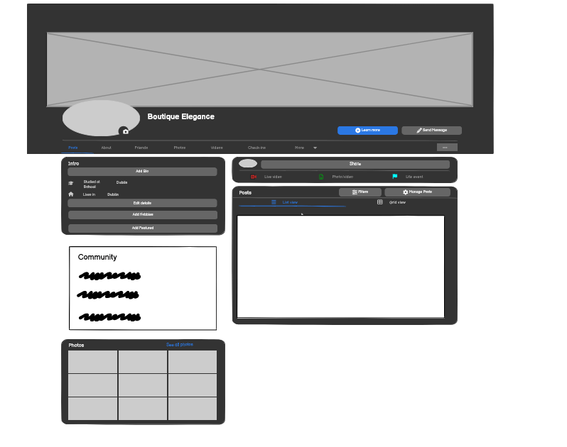

# BOUTIQUE ELEGANCE

Boutique Elegance is a webshop desined for clothes, shoes, bath & bed, kitchen, active wear. This site is desined towards users that are interested in having everything on one place. Users can browse and purcase different types of items.

The payment system for this site uses Stripe. Please note that this website is for educational purposes do not enter any personal credit/debit card details when using the site.


## User Experience (UX)

A visitor to Fresh Nest would be someone who is most likely an adult who is interested in buying clothes, homewear, activewear, kicthen devices etc.

### User Stories

#### EPIC | Viewing and Navigation
- As a site user I can intuitively navigate around the site so that I can find content.
- As a site user I can view a list of products so that I can select a product to view.
- As a shopper I can click on a product so that I can read the full product details.
- As a shopper I can view a specific category of products so I can browse the type of products I am interested in.
- As a shopper I can search all products so that I can find what I am looking for.
- As a shopper I can sort all products so that I can view products based on price or title.

#### EPIC | User Account and Profile
- As a site user, I can register an account so that I can have a personal account.
- As a site user, I can log in or log out of my account so that I can keep my account secure.
- As a site user, I can see my login status so that I know if I'm logged in or out.
- As a site user, I can save my personal details in my user profile so that I do not have to fill them out for future orders.
- As a site user, I can view my order history so that I can remember what purchases I've made.
- As a site user, I can recover my password in case I forget it so that I can recover access to my account.

#### EPIC | Purchasing
- As a shopper, I can add a number of products in different quantities to my shopping bag so that I can purchase them all together when I am ready.
- As a shopper, I can view a running total of my shopping bag as I am shopping so that I can see how much it costs in total.
- As a shopper, I can view the contents of my shopping bag at any time so I can see what is included and the total cost.
- As a shopper, I can adjust the quantity of individual products in my bag so that I can easily make changes before I purchase.
- As a shopper, I can see a summary of my shopping cart when I checkout so that I know what products are included and the total cost before I commit to purchasing.
-As a shoper I can choose different outfits and get a discount price on that.
- As a shopper, I can easily enter my payment information securely so that I can purchase my chosen products quickly with no issues.
- As a shopper checkout as a guest so I don't have to sign up for an account.
- As a shopper, I can view an order confirmation after checkout so that I know my purchase was successful.
- As a shopper, I can receive an email confirmation of my order so that I have a record of my purchase.

#### EPIC | Admin & Store Management
- As a store owner, I can add/edit/delete products through an easy-to-use interface so that I can manage the store's contents.
- As a site owner, I can add/delete images and location of previous design projects so that I can manage the site's contents.
- As a site owner, I can view and delete customer enquiries on the front-end without having to access the admin panel.

### Design
- Design of this website is elegant and clean. Colours of this website is combination of dark brown and beige colour.

#### Imagery
There is only one main static image on the site which is background picture of a webshop on a main page. All of the pictures are there to show a prduct.

## Security Features and Defensive Design
### User Authentication

Where I have used Django's Class-based-views; Django's LoginRequiredMixin is used to make sure that any requests to access secure pages by non-authenticated users are redirected to the login page. Django's UserPassesTestMixin is used to limit access based on certain permissions i.e. to ensure users can only edit/delete Testimonials for which they are the author or if the user is the superuser. If the user doesn't pass the test they are shown an HTTP 403 Forbidden error.

Where I have used function based views I have used Django's login_required and user_passes_test decorators to restrict access as required. 

### Form Validation
If incorrect or empty data is added to a form, the form won't submit and a warning will appear to the user informing them what field raised the error.

### Database Security
The database url and secret key are stored in the env.py file to prevent unwanted connections to the database. Stripe keys and wh secret are also stored in the env.py file. 

### Custom error pages:
Custom Error Pages were created to give the user more information on the error and to provide them with buttons to guide them back to the site.

400 Bad Request - Boutique Elegance is unable to handle this request.
403 Page Forbidden - Looks like you're trying to access forbidden content. Please log out and sign in to the correct account.
404 Page Not Found - The page you're looking for doesn't exist.
500 Server Error - Due to an internal error we are unable to process this request.

## Features
### Header

**Navigation Bar**
- The navigation bar is visible at the top of every page and includes links to the other pages.

**Search Bar**
- The search bar displays above the nav bar.
- On smaller screens, this bar becomes a search icon which when clicked will drop down the full bar.
- Any searched word will match itself to any text in the product's title, or description and display the results on the product's page.

### Home Page
- The home page includes a call to action section which encourages the user to 'shop now' and an image of stylish boutique.

### User Account Pages
**Sign Up**

**Sign In**


### Profile
**Delivery Details**


- The delivery details section shows user's adress and phone number.
- The information provided here is used to autofill the delivery address when placing an order.

**Order History**


- The order history section displays a list of every order the user has placed.
- The table displays the order number, date it was ordered and the order total.
- Clicking the order number will take the user to a summary page of that order.

### Product Detail


- When user clicks on the product, every detail of specific product is shown on the screen.
- If the user is a superuser, edit and delete buttons will appear below these details.

### Product menagment

- In this part of the web shop is possible for superuser to add product, images, sizes etc.

**Edit Product**
- The superuser can choose to edit a Product by clicking the edit button on the product card or on the product detail page. 
- The form opens with all fields populated with the original content.
- If a user tries to add a product (by changing the url) without being a superuser they are redirected to a custom 403 page.

**Details**
- In the details section the user can fill out their contact details, delivery address, and card number.
- If the user is a guest, a link to create an account or login will be present.
- If the user is signed in a checkbox to save the delivery information can be checked.
- If the user is signed in and has delivery information saved, the delivery details and email address will be automatically filled in.
- If a user leaves a required field empty, inputs whitespace in a required field or includes text in the phone number field an error message will prompt the user to 'Fill in the field' or 'match the format requested'.

**Order Summary**
- The order summary section details all the items about to be purchased, along with the quantity, subtotal and a grand total.
- Clicking the product image in the summary will take the user to that product's detail page.

**Payment**
- Payment options is handled by Stripe to ensure secure payment.
- Incorrect card numbers will automatically show an invalid card number error.
- A loading screen will appear when a payment is being processed to stop the user clicking away.
- Once the payment is processed, the webhook will search the database to confirm the order exists. If it cannot find it, it will create one using the payment information.

**Confirmation**


- Once order has been placed and processed the user is taken to the checkout success page.
This page summarises the completed order.
- An email will be sent to the user with their order confirmation
- At the end of the summary is a 'Keep Shopping' button.

## Error Pages

![403 error]
- Custom error pages are made to show up when it is not possible to enter a page and with that navigate user to the website again.
- 400 Bad Request - Fresh Nest is unable to handle this request.
- 403 Page Forbidden - Looks like you're trying to access forbidden content. Please log out and sign in to the correct account.
- 404 Page Not Found - The page you're looking for doesn't exist.
- 500 Server Error - Due to an internal error we are unable to process this request.

#### Wireframes


## Business Model

- Boutique Elegance is a web shop mostly desined for adult people that are interested in clothes, homewear, activewear, kitchen and bath supplies.

## Marketing Strategy
- A number of different marketing strategies have been utilised to promote Boutique Elegance including SEO and social media marketing.

Facebook wireframe page of Boutique elegance can be found bellow.


### SEO
Several SEO techniques were undertaken in order to ensure the site ranks highly in search engine results:

**Keywords:** 

A mixture of short tail and long tail keywords were carefully considered for the site. Keyword research was performed by checking Google search results, looking at competitor's keywords and by utilising wordtracker.com. 

A list of keywords can be found bellow:
- Elegant
- Boutique
- Elegance
- Products
- Homewear
- Luxury design
- Desiner clothes
- Price
- Home decor
- Home improvment
- Bath decor
- Bath
- Gym
- Active wear

The most relevant keywords have been added to the site's meta-keywords and meta-description. These keywords have also been carefully included in page titles, headings, site content, `<strong></strong>` tags, image alt attributes and anchor tag links across the site. 

## Deployment - Heroku
- To deploy this page to Heroku from its GitHub repository, the following steps were taken.
### Create the Heroku App:
- Log in to Heroku and create account.
- On the main page click the button labelled New in the top right corner and from the drop-down menu select "Create New App".
- Enter a unique and meaningful app name.
- Select your region and click create app.

### Attach the Postgres database:
- In the Resources tab, under add-ons, type in Postgres and select the Heroku Postgres option.
- Copy the DATABASE_URL located in Config Vars in the Settings Tab.

### Attach the Postgres database:
- In the Resources tab, under add-ons, type in Postgres and select the Heroku Postgres option.
- Copy the DATABASE_URL located in Config Vars in the Settings Tab.
- Go back to your IDE and install 2 more requirements:
    - `pip3 install dj_databse_url`
    - `pip3 install psycopg2-binary` 
- Create requirements.txt file by typing `pip3 freeze --local > requirements.txt`
- Add the DATABASE_URL value and your chosen SECRET_KEY value to the env.py file. 
- In settings.py file import dj_database_url, comment out the default configurations within database settings and add the following: 

```
DATABASES = {
    'default': dj_database_url.parse(os.environ.get('DATABASE_URL'))
}
```
- Run migrations and create a superuser for the new database. 
- Create an if statement in settings.py to run the postgres database when using the app on heroku or sqlite if not

```
    if 'DATABASE_URL' in os.environ:
        DATABASES = {
            'default': dj_database_url.parse(os.environ.get('DATABASE_URL'))
        }
    else:
        DATABASES = {
            'default': {
                'ENGINE': 'django.db.backends.sqlite3',
                'NAME': BASE_DIR / 'db.sqlite3',
            }
    }
```

- Create requirements.txt file by typing `pip3 freeze --local > requirements.txt`
- Create a file named "Procfile" in the main directory and add the following: `web: gunicorn project-name.wsgi:application`
- Add Heroku to the ALLOWED_HOSTS list in settings.py in the format ['app_name.heroku.com', 'localhost']

- Push these changes to Github.

### Update Heroku Config Vars:
- Heroku vars should look like this:
 
 AWS_ACCESS_KEY_ID      AWS CSV file                                               
 AWS_SECRET_ACCESS_KEY  AWS CSV file                                               
 DATABASE_URL           Postgres generated                                        
 EMAIL_HOST_PASS        Password from email client                                                    
 EMAIL_HOST_USER        Site's email address                                                          
 SECRET_KEY             Random key generated as above                                                 
 STRIPE_PUBLIC_KEY      Stripe Dashboard > Developers tab > API Keys > Publishable key                
 STRIPE_SECRET_KEY      Stripe Dashboard > Developers tab > API Keys > Secret key                     
 STRIPE_WH_SECRET       Stripe Dashboard > Developers tab > Webhooks > site endpoint > Signing secret 
 USE_AWS                True (when AWS set up - instructions below)                                   


### Deploy

- For every deployment DEBUG= False in settings.py.
- On deploy tab on Heroku connect your project to Heroku.
- Scroll down and deploy page manually.
- Click view.

## AWS Set Up
### AWS S3 Bucket
- Create an AWS account.
- From the 'Services' tab on the AWS Management Console, search 'S3' and select it.
- Click 'Create a new bucket', give it a name(match your Heroku app name if possible), and choose the region closest to you.
- Under 'Object Ownership' select 'ACLs enabled' and leave the Object Ownership as Bucket owner preferred.
- Uncheck block all public access and acknowledge that the bucket will be public.
- Click 'Create bucket'.

### Connecting S3 to Django 
### IAM
- From the 'Services' menu, search IAM and select it.
- Once on the IAM page, click 'User Groups' from the side bar, then click 'Create group'. Choose a name and click 'Create'.
- Go to 'Policies', click 'Create New Policy'. Go to the 'JSON' tab and click 'Import Managed Policy'. 
- Search 'S3' and select 'AmazonS3FullAccess'. Click 'Import'.
- Get the bucket ARN from 'S3 Permissions' as per above.
- Delete the '*' from the 'Resource' key and add the following code into the area:

```
"Resource": [
    "YOUR-ARN-NO-HERE",
    "YOUR-ARN-NO-HERE/*"
]
```

- Click 'Next Tags' > 'Next Review' and then provide a name and description and click 'Create Policy'.
- Click'User Groups' and open the created group. Go to the 'Permissions' tab and click 'Add Permissions' and then 'Attach Policies'.
- Search for the policy you created and click 'Add Permissions'.
- You need to create a user to put in the group. Select users from the sidebar and click 'Add user'.
- Give your user a user name, check 'Programmatic Access'.
- Click 'Next' and select the group you created.
- Keep clicking 'Next' until you reach the 'Create user' button and click that.
- Download the CSV file which contains the AWS_SECRET_ACCESS_KEY and your AWS_ACCESS_KEY_ID needed in the Heroku variables as per above list and also in your env.py.


### Connecting S3 to Django 
- Go back to your IDE and install 2 more requirements:
    - `pip3 install boto3`
    - `pip3 install django-storages` 
- Update your requirements.txt file by typing `pip3 freeze --local > requirements.txt` and add storages to your installed apps.
- Create an if statement in settings.py 

```
if 'USE_AWS' in os.environ:
    AWS_STORAGE_BUCKET_NAME = 'insert-your-bucket-name-here'
    AWS_S3_REGION_NAME = 'insert-your-region-here'
    AWS_ACCESS_KEY_ID = os.environ.get('AWS_ACCESS_KEY_ID')
    AWS_SECRET_ACCESS_KEY = os.environ.get('AWS_SECRET_ACCESS_KEY')

```
- Then add the line 

    - `AWS_S3_CUSTOM_DOMAIN = f'{AWS_STORAGE_BUCKET_NAME}.s3.amazonaws.com'` to tell django where our static files will be coming from in production.


- Create a file called custom storages and import both our settings from django.con as well as the s3boto3 storage class from django storages. 
- Create the following classes:

```
class StaticStorage(S3Boto3Storage):
    location = settings.STATICFILES_LOCATION

class MediaStorage(S3Boto3Storage):
    location = settings.MEDIAFILES_LOCATION
```

- In settings.py add the following inside the if statement:

```
STATICFILES_STORAGE = 'custom_storages.StaticStorage'
STATICFILES_LOCATION = 'static'
DEFAULT_FILE_STORAGE = 'custom_storages.MediaStorage'
MEDIAFILES_LOCATION = 'media'
STATIC_URL = f'https://{AWS_S3_CUSTOM_DOMAIN}/{STATICFILES_LOCATION}/'
MEDIA_URL = f'https://{AWS_S3_CUSTOM_DOMAIN}/{MEDIAFILES_LOCATION}/'

```

- and then add the following at the top of the if statement:
```
AWS_S3_OBJECT_PARAMETERS = {
    'Expires': 'Thu, 31 Dec 2099 20:00:00 GMT',
    'CacheControl': 'max-age=94608000',
}
```

- Go to S3, go to your bucket and click 'Create folder'. Name the folder 'media' and click 'Save'.
- Inside the folder, click 'Upload', 'Add files', and then select all the images that you are using for your site.
- Then under 'Permissions' select the option 'Grant public-read access' and click upload.
- Your static files and media files should be automatically linked from django to your S3 bucket.

## Languages

- Python
- HTML
- CSS
- Javascript

## Frameworks - Libraries - Programs Used
- [Django](https://www.djangoproject.com/)
- [Django-allauth](https://django-allauth.readthedocs.io/en/latest/installation.html)
- [JQuery](https://jquery.com/)
- [PostgreSQL](https://www.postgresql.org/)
- [SQLite](https://www.sqlite.org/index.html)
- [Stripe](https://stripe.com/ie)
- [AWS](https://aws.amazon.com/?nc2=h_lg)
- [Heroku](https://dashboard.heroku.com/login)
- [Responsinator](http://www.responsinator.com/)
- [Balsamiq](https://balsamiq.com/)
- [Font Awesome](https://fontawesome.com/)
- [GitHub](https://github.com/)
- [Google Fonts](https://fonts.google.com/)
- [W3C](https://www.w3.org/)
- [Jshint](https://jshint.com/)
- [Sitemap Generator](www.xml-sitemaps.com)

## Credits
- [W3Schools](https://www.w3schools.com/)
- [Django Docs](https://docs.djangoproject.com/en/4.0/)
- [Bootstrap 4.6 Docs](https://getbootstrap.com/docs/4.6/getting-started/introduction/)
- [Stack Overflow](https://stackoverflow.com/)
- [Code Institute - Boutique Ado Walkthrough Project](https://github.com/Code-Institute-Solutions/boutique_ado_v1)
- [Code Institute- Fresh nest project](https://github.com/AliOKeeffe/PP5-Fresh-Nest/blob/main/README.md?plain=1)


## Acknowledgments
- Thanks to my mentor Antonio for his support and advice. Thanks to The Code Institute slack community for their quick responses and very helpful feedback.


